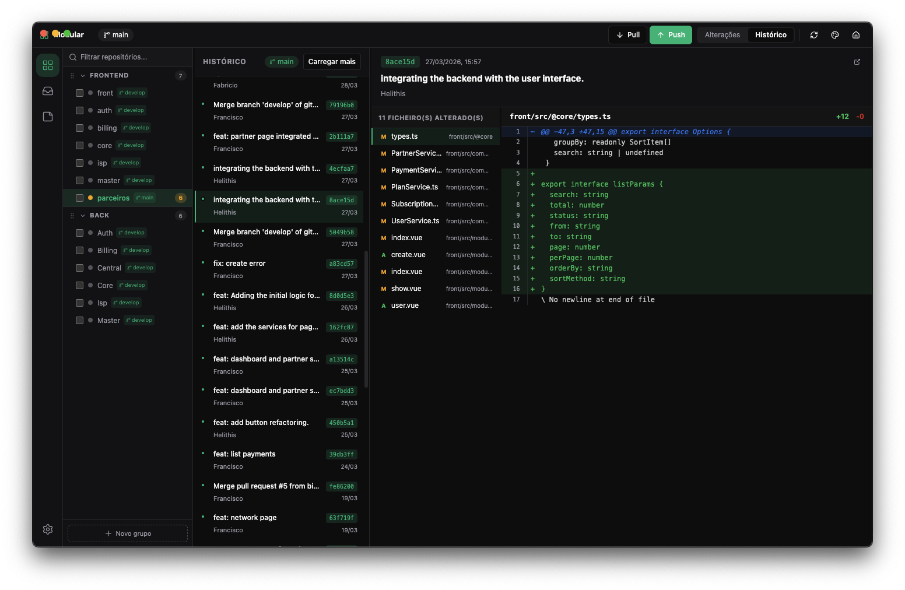

# Orbit

> *The developer's cockpit — multi-repo git dashboard, issues, focus.*

Dashboard desktop para quem trabalha com vários repositórios ao mesmo tempo. Construído em Electron + Vue 3 + TypeScript.



---

## O problema

Hoje em dia um projecto raramente vive num único repositório. É normal ter:

- 1 repo para o front-end
- 1 repo para o back-end / API
- 1 repo para o painel admin
- 1 repo para a app mobile
- 1 repo para a landing page
- 1 repo para serviços partilhados / SDK
- 1 repo para infra / deploy
- … e por aí fora

Quando precisas de fazer uma alteração que toca em vários módulos, a história repete-se:

```bash
cd repo-1 && git status && git add . && git commit -m "..." && git push
cd ../repo-2 && git status && git add . && git commit -m "..." && git push
cd ../repo-3 && git status && git add . && git commit -m "..." && git push
# ...e assim por diante
```

Abrir 10 terminais. Saltar de janela em janela. Esquecer um repo no caminho. Reabrir tudo no dia seguinte. **É lento, é cansativo e tira o foco.**

Ferramentas como o GitHub Desktop são óptimas — mas pensadas para **um repo de cada vez**. Quando o teu fluxo é multirepo, ficas a faltar metade da coisa.

---

## Como o Orbit resolve

O Orbit trata um **projecto** como um conjunto de repositórios agrupados, e dá-te uma vista única para operar sobre todos eles.

### Funcionalidades principais

- **Multi-repo dashboard** — vê o estado (staged / unstaged / branch / ahead-behind) de todos os repos num só ecrã.
- **Bulk actions** — commit, push e pull em vários repos seleccionados de uma vez só.
- **Diff viewer integrado** — slide-in, com stats de adições/remoções, toggle working-tree/staged, e stage/unstage directamente do viewer.
- **Resolvedor de conflitos built-in** — lida com merge conflicts sem ter de saltar para o editor.
- **Histórico visual** — log de commits com filtros por repo.
- **Issues no mesmo sítio** — issues locais (offline, em SQLite) + integração com issues do GitHub, lado a lado.
- **Notas** — editor próprio para briefs, ideias, rascunhos e contexto que não cabe num README.
- **Drag & drop** — organiza grupos de repos e reordena à vontade. Auto-save.
- **Backup do workspace** — exporta/importa a configuração do projecto em `.orbit.json`.
- **Multi-idioma & temas** — i18n com vue-i18n, theme picker integrado.
- **Tudo offline** — armazenamento local em SQLite (`better-sqlite3`). Não precisa de conta, não precisa de cloud.

### Stack

- **Electron 33** — shell desktop
- **Vue 3 + Composition API** + **Pinia** — UI e estado
- **TypeScript** — tipagem em todo o lado (renderer + main)
- **Tailwind CSS** + **radix-vue** — design system
- **simple-git** — operações git no main process
- **better-sqlite3** — persistência local
- **vue-draggable-plus** — drag & drop
- **electron-vite** — build & hot-reload

### Arquitectura, em três linhas

```
electron/main.ts         ← cria a BrowserWindow, regista IPC handlers
electron/ipc/*.ts        ← git, github, notes, localIssues, backup, conflicts
electron/preload.ts      ← expõe window.electron via contextBridge
src/                     ← Vue SPA (router em hash, Pinia stores)
```

Toda a operação git/IO acontece no main process; o renderer fala com ele só por IPC. Sem `nodeIntegration`, sem dores de cabeça de segurança.

---

## Como começar

```bash
# clonar
git clone <url-do-repo>
cd orbit

# instalar
npm install

# correr em dev (hot-reload)
npm run dev

# build de produção
npm run build

# empacotar para a tua plataforma
npm run dist:mac     # ou dist:win / dist:linux
```

---

## Próximos passos (roadmap)

O Orbit é uma **versão 0.1**. Construído em duas semanas. Funciona, mas tem bastante para evoluir.

### Curto prazo
- [ ] Stash management (criar / listar / aplicar / dropar)
- [ ] Rebase interactivo com UI
- [ ] Cherry-pick entre branches
- [ ] Suporte a submodules
- [ ] Atalhos de teclado configuráveis
- [ ] Pesquisa global (commits, issues, notas, ficheiros)

### Médio prazo
- [ ] Integração com GitLab e Bitbucket (hoje só GitHub)
- [ ] Pull Request review dentro do app
- [ ] CI status por repo (✓/✗ ao lado do branch)
- [ ] Templates de commit (Conventional Commits, gitmoji, etc.)
- [ ] Hooks visuais (pre-commit / pre-push) com toggle on/off

### Longo prazo
- [ ] Modo "focus" — esconde tudo excepto um repo, com timer Pomodoro
- [ ] Sync opcional entre dispositivos (mantendo a opção offline-first)
- [ ] Plugin system para extensões da comunidade
- [ ] Suporte a monorepos (workspaces) como "primeiros cidadãos"
- [ ] Auto-update via electron-updater

---

## Contribuir

O projecto é **open source** e contribuições são bem-vindas. Mas um aviso, com a mão no coração:

> Isto é código de **duas semanas**, movido a café e bebida energética. Há partes que ainda precisam de carinho. **Não me julguem muito** 😅. Issues construtivas e PRs são abraçados de braços abertos.

### Como contribuir

1. Abre uma issue antes de PRs grandes — vamos alinhar antes de gastares tempo.
2. Para bugs, inclui passos para reproduzir + versão do Orbit + sistema operativo.
3. Para features, descreve o caso de uso primeiro, a solução depois.
4. Mantém o código com `npm run typecheck` a passar.

---

## Licença

MIT.

---

**Orbit** — feito por [BIT — Bantu Internet Technologies, Lda.](https://github.com/) 🇦🇴
